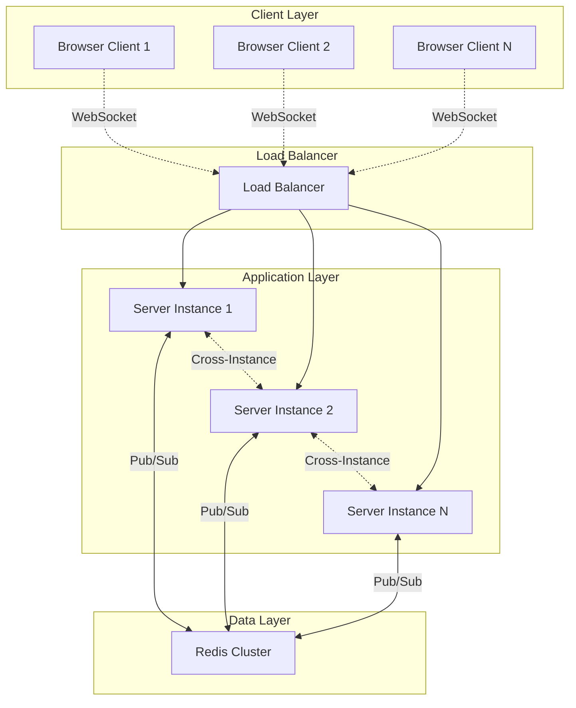
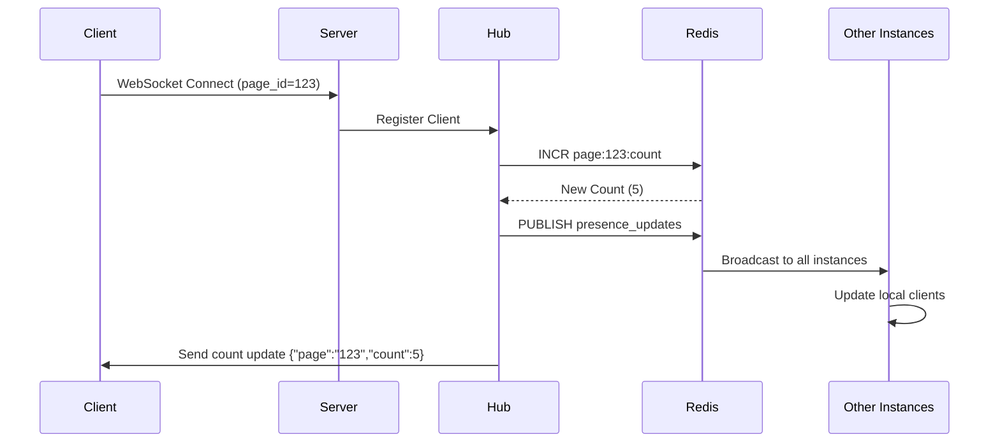
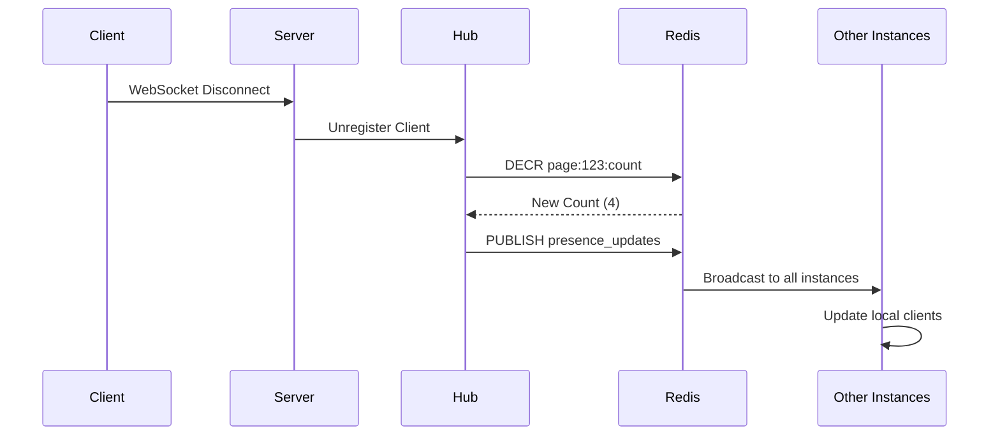

# 🚀 Live User Count System

A **real-time, scalable user presence tracking system** built with Go, WebSockets, and Redis. This system tracks and broadcasts live user counts per page across multiple server instances with sub-second latency.

## 📋 Table of Contents

- [Overview](#overview)
- [Architecture](#architecture)
- [System Components](#system-components)
- [Features](#features)
- [Technology Stack](#technology-stack)
- [Project Structure](#project-structure)
- [API Endpoints](#api-endpoints)
- [WebSocket Protocol](#websocket-protocol)
- [Data Flow](#data-flow)
- [Setup & Installation](#setup--installation)
- [Configuration](#configuration)
- [Usage Examples](#usage-examples)
- [Scaling Considerations](#scaling-considerations)
- [Performance](#performance)
- [Future Improvements](#future-improvements)

## 🎯 Overview

This system provides **real-time user presence tracking** for web applications. It can track how many users are currently viewing each page/section of your application and broadcast updates instantly to all connected clients.

### Key Capabilities:

- ✅ **Real-time updates** with WebSocket connections
- ✅ **Page-based grouping** of users
- ✅ **Horizontal scaling** across multiple server instances
- ✅ **Persistent state** with Redis backend
- ✅ **Automatic connection management** and cleanup
- ✅ **Sub-second latency** for presence updates

## 🏗️ Architecture



### Architecture Principles:

1. **Event-Driven**: Uses channels and goroutines for concurrent processing
2. **Stateless Servers**: All state stored in Redis for horizontal scaling
3. **Pub/Sub Pattern**: Redis handles cross-instance communication
4. **Hub Pattern**: Centralized WebSocket connection management

## 🔧 System Components

### 1. **WebSocket Hub (`service/hub.go`)**

- **Centralized connection manager** for all WebSocket clients
- **Thread-safe operations** using channels and mutexes
- **Page-based client grouping** for targeted message broadcasting

```go
type Hub struct {
    clients    map[string]map[*Client]bool  // pageID -> clients mapping
    register   chan *Client                 // New client registration
    unregister chan *Client                 // Client disconnection
    broadcast  chan []byte                  // Redis pub/sub messages
    mu         sync.RWMutex                 // Concurrent access protection
}
```

### 2. **Redis Service (`service/redis.go`)**

- **Distributed state management** with atomic counters
- **Pub/Sub messaging** for cross-instance synchronization
- **Persistent storage** for user counts

Key Operations:

- `IncrCount(pageID)` - Atomic increment user count
- `DecrCount(pageID)` - Atomic decrement with negative protection
- `GetCount(pageID)` - Retrieve current count
- `publishPresence()` - Broadcast updates to all instances

### 3. **Configuration Management (`utils/config.go`)**

- **Environment-based configuration** using Viper
- **Type-safe config struct** with validation
- **Support for .env files** and environment variables

### 4. **HTTP Server (`main.go`)**

- **Gin framework** for HTTP routing
- **WebSocket upgrade endpoint**
- **REST API** for count retrieval
- **Health check endpoint**

## ✨ Features

### Real-Time Features:

- **Instant presence updates** when users join/leave
- **WebSocket-based communication** with automatic reconnection
- **Page-specific tracking** (users only see counts for their current page)
- **Connection health monitoring** with ping/pong

### Scalability Features:

- **Horizontal scaling** across multiple server instances
- **Redis-based state sharing** between instances
- **Load balancer compatible**
- **Graceful connection handling**

### Reliability Features:

- **Automatic connection cleanup** on client disconnect
- **Negative count protection** (counts never go below 0)
- **Error recovery** for Redis connection issues
- **Connection timeout handling**

## 🛠️ Technology Stack

| Component          | Technology        | Purpose                               |
| ------------------ | ----------------- | ------------------------------------- |
| **Backend**        | Go 1.24+          | High-performance concurrent server    |
| **WebSockets**     | Gorilla WebSocket | Real-time bidirectional communication |
| **HTTP Framework** | Gin               | REST API and WebSocket upgrade        |
| **Database**       | Redis             | Distributed state and pub/sub         |
| **Configuration**  | Viper             | Environment-based config management   |

## 📁 Project Structure

```
live-user-count/
├── main.go                 # Application entry point & HTTP server
├── go.mod                  # Go modules definition
├── go.sum                  # Go modules checksums
├── .env                    # Environment configuration
├── README.md               # This documentation
│
├── service/                # Core business logic
│   ├── hub.go             # WebSocket hub & client management
│   └── redis.go           # Redis operations & pub/sub
│
├── utils/                  # Utility packages
│   └── config.go          # Configuration management
│
└── test/                   # Test files & examples
    └── index.html         # Frontend demo page
```

## 🌐 API Endpoints

### WebSocket Endpoint

```
GET /ws?page_id={pageID}
```

- **Upgrades HTTP to WebSocket**
- **page_id**: Optional query parameter (defaults to "default")
- **Returns**: WebSocket connection for real-time updates

### REST Endpoints

#### Get Current Count

```http
GET /count/{pageID}
```

**Response:**

```json
{
  "page": "homepage",
  "count": 42
}
```

#### Health Check

```http
GET /health
```

**Response:**

```json
{
  "ok": true
}
```

#### Static Demo Page

```http
GET /
```

Returns the demo HTML page for testing.

## 🔌 WebSocket Protocol

### Client → Server

Currently, clients only need to maintain the connection. No specific messages required.

### Server → Client

**Presence Update Message:**

```json
{
  "page": "homepage",
  "count": 42
}
```

### Connection Lifecycle:

1. **Connect**: Client opens WebSocket with `page_id` parameter
2. **Register**: Server adds client to hub and increments Redis counter
3. **Updates**: Server broadcasts count changes to all clients on same page
4. **Disconnect**: Server removes client and decrements counter
5. **Cleanup**: Connection resources automatically freed

## 🔄 Data Flow

### User Joins Page:



### User Leaves Page:



## 🚀 Setup & Installation

### Prerequisites:

- **Go 1.24+**
- **Redis Server** (local or cloud)
- **Git**

### Installation Steps:

1. **Clone Repository:**

```bash
git clone https://github.com/AnkitNayan83/live-user-count.git
cd live-user-count
```

2. **Install Dependencies:**

```bash
go mod download
```

3. **Configure Environment:**
   Create `.env` file:

```env
REDIS_URL=localhost:6379
REDIS_PASSWORD=your_redis_password
PORT=:8080
```

4. **Start Redis** (if running locally):

```bash
redis-server
```

5. **Run Application:**

```bash
go run main.go
```

6. **Test the System:**
   Open multiple browser tabs to `http://localhost:8080`

## ⚙️ Configuration

### Environment Variables:

| Variable         | Description          | Required | Default |
| ---------------- | -------------------- | -------- | ------- |
| `REDIS_URL`      | Redis server address | ✅       | -       |
| `REDIS_PASSWORD` | Redis authentication | ✅       | -       |
| `PORT`           | Server listen port   | ✅       | -       |

### Redis Configuration:

- **Database**: Uses DB 0
- **Key Pattern**: `page:{pageID}:count`
- **Pub/Sub Channel**: `presence_updates`

### WebSocket Configuration:

- **Read Buffer**: 1024 bytes
- **Write Buffer**: 1024 bytes
- **Read Timeout**: 60 seconds
- **Ping Interval**: 30 seconds

## 💡 Usage Examples

### Frontend Integration:

```javascript
// Connect to WebSocket
const socket = new WebSocket("ws://localhost:8080/ws?page_id=homepage");

// Handle connection
socket.onopen = () => console.log("Connected to live count");

// Handle updates
socket.onmessage = (event) => {
  const data = JSON.parse(event.data);
  document.getElementById(
    "userCount"
  ).textContent = `${data.count} users online`;
};

// Handle errors
socket.onclose = () => console.log("Disconnected");
socket.onerror = (err) => console.error("WebSocket error:", err);
```

### REST API Usage:

```bash
# Get current count for a page
curl http://localhost:8080/count/homepage

# Health check
curl http://localhost:8080/health
```

### Multiple Page Tracking:

```javascript
// Track different pages/sections
const pageId = window.location.pathname.replace("/", "") || "home";
const socket = new WebSocket(`ws://localhost:8080/ws?page_id=${pageId}`);
```

## 👨‍💻 Author

**Ankit Nayan**

- GitHub: [@AnkitNayan83](https://github.com/AnkitNayan83)
- LinkedIn: [Ankit Nayan](https://www.linkedin.com/in/ankit-nayan-816337221/)

---

⭐ **Star this repository if you found it helpful!**
